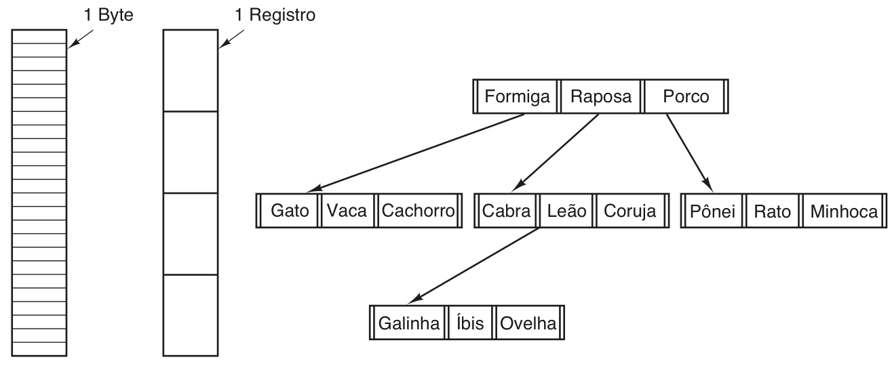

# Sistema de arquivos
O sistema de arquivos é uma abstração do armazenamento do sistema computacional. Através dos arquivos é possível interagir com as informações armazenadas em disco de uma forma estruturada e segura.

## Arquivos
Os arquivos são a principal unidade de abstração do sistema de arquivos. É através deles que o usuário pode interagir com a informação armazenada em disco. Cada sistema operacional decide como lidar com os nomes de arquivos e suas extensões. Em sistemas *UNIX*, os nomes de arquivos são *case-sensitive*, e suas extensões não tem significado algum para o sistema (porém podem ser relevantes para programas que atuam sobre esses arquivos).
Os arquivos podem ser estruturados de diversas formas a um nível de sistema operacional, entretanto é comum em sistemas operacionais modernos que eles sejam apenas uma sequência de bytes, sem nenhuma estrutura clara.

Essa abordagem garante a maior flexibilidade, permitindo que os arquivos sejam estruturados de qualquer maneira em um nível mais alto do sistema.
Os arquivos podem ser lidos sequencialmente ou fora de ordem, isto é, a partir de qualquer posição. Arquivos que podem ser lidos em qualquer ordem são chamados de **arquivos de acesso aleatório**. Nesse tipo de arquivo é possível iniciar a leitura de qualquer posição, e também mover o cursor de leitura para qualquer posição do arquivo, dando muito mais liberdade para seu acesso.
Além de seus conteúdos de fato, também são armazenados nos arquivos algumas informações relevantes para o sistema operacional, esses são os *atributos* (ou metadados) do arquivo. Nos atributos estão presentes informações como permissões de leitura e escrita, datas de alteração e criação, entre outros.

## Diretórios
Os diretórios são utilizados para organizar e controlar os arquivos, porém também são fundamentalmente arquivos. Com diretórios é possível organizar os arquivos de uma maneira hierárquica que faça sentido para o usuário, também se torna possível a criação de diretórios privados para cada usuário mantendo a separação e organização dos arquivos.

Cada processo tem seu próprio diretório de trabalho. Isso permite que os arquivos sejam referenciados através de um *caminho absoluto* (a partir do diretório raiz do sistema de arquivos), ou um *caminho relativo* (a partir do diretório de trabalho atual).
